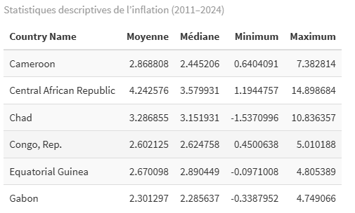
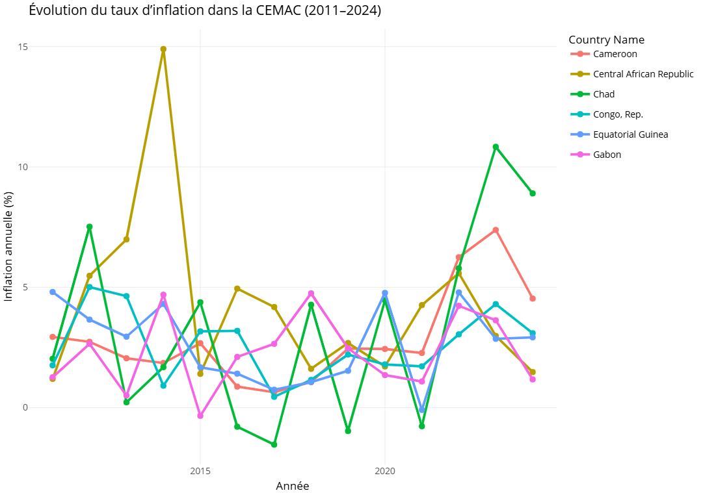
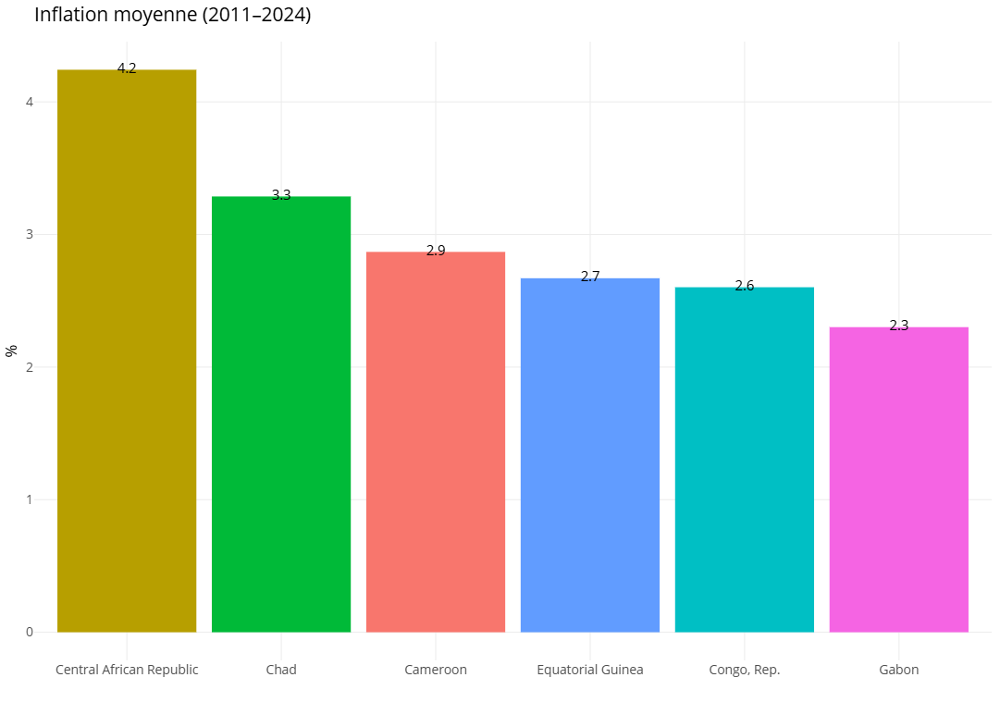

## Inflation et pouvoir d’achat dans la zone CEMAC (2011–2024)
*Analyse exploratoire à partir des données de la Banque mondiale*

## 1️⃣ **Introduction**

Ce rapport présente une analyse de l’évolution du taux d’inflation dans les six pays membres de la Communauté Économique et Monétaire de l’Afrique Centrale (CEMAC) entre 2011 et 2024.
L’objectif est de comprendre les tendances de l’inflation, d’évaluer les disparités entre pays et d’en tirer des enseignements sur le pouvoir d’achat et la stabilité macroéconomique de la sous-région.

**Pays étudiés :** Cameroun, Gabon, Congo, Tchad, République Centrafricaine, Guinée Équatoriale.
**Source :** *World Development Indicators – Banque mondiale (Inflation, consumer prices (%))*.

## 2️⃣ **Méthodologie**

* **Outils utilisés :** R (packages *tidyverse*, *lubridate*, *plotly*, *kableExtra*).
* **Période étudiée :** 2011–2024 (les données avant 2011 ont été exclues pour homogénéiser les séries temporelles).
* **Traitement :**

  * Filtrage des pays de la CEMAC.
  * Conversion du champ `Date` en `year`.
  * Nettoyage des valeurs manquantes.
  * Calcul des statistiques descriptives (moyenne, médiane, min, max).
  * Visualisation des tendances temporelles et comparaisons inter-pays.

## 3️⃣ **Résultats descriptifs**

### 3.1 Statistiques globales (2011–2024)

> *(Table générée avec `kableExtra`)*

➡️ Cette table permet de comparer la stabilité ou la volatilité des prix à la consommation entre les pays.

---

### 3.2 Évolution de l’inflation par pays

📈 *Graphique interactif Plotly (p1)* :
**Titre :** “Évolution du taux d’inflation dans la CEMAC (2011–2024)”

Ce graphique illustre les fluctuations annuelles de l’inflation pour chaque pays.
On observe :

* Des pics d’inflation marqués au Tchad et en RCA entre 2014 et 2017.
* Une relative stabilité au Cameroun et au Gabon.
* Des variations erratiques en Guinée Équatoriale, probablement liées aux chocs pétroliers.

### 3.3 Comparaison des moyennes d’inflation

📊 *Graphique interactif Plotly (p2)* :
**Titre :** “Inflation moyenne par pays (2011–2024)”

Les pays présentant une inflation moyenne supérieure à la moyenne régionale traduisent une perte plus rapide du pouvoir d’achat des ménages.
Cette comparaison met en évidence :

* Un **Cameroun** relativement stable.
* Un **Tchad** plus exposé à l’instabilité macroéconomique.
* Une **RCA** aux niveaux d’inflation les plus volatils.

## 4️⃣ **Interprétation et implications**

* Une inflation modérée (2–4%) reflète une bonne maîtrise des politiques monétaires.
* Des pics d’inflation sont souvent corrélés à des facteurs externes (prix du pétrole, conflits, dépendance alimentaire).
* La convergence des politiques monétaires dans la CEMAC reste incomplète.
* L’impact sur le **pouvoir d’achat** demeure contrasté : le niveau de revenu réel a davantage chuté dans les pays à inflation élevée.

## 5️⃣ **Recommandations**

1. **Renforcer la surveillance macroéconomique régionale** (BEAC, CEMAC).
2. **Promouvoir la diversification économique** pour réduire la dépendance aux matières premières.
3. **Soutenir la production locale** pour limiter la transmission de l’inflation importée.
4. **Améliorer la collecte et la diffusion de données économiques** pour une prise de décision fondée sur l’évidence.

## 6️⃣ **Conclusion**

Entre 2011 et 2024, la CEMAC a connu des niveaux d’inflation hétérogènes, reflétant la vulnérabilité structurelle de ses économies.
L’analyse met en évidence la nécessité de renforcer la coordination des politiques économiques pour préserver le pouvoir d’achat et assurer la stabilité monétaire dans la sous-région.

